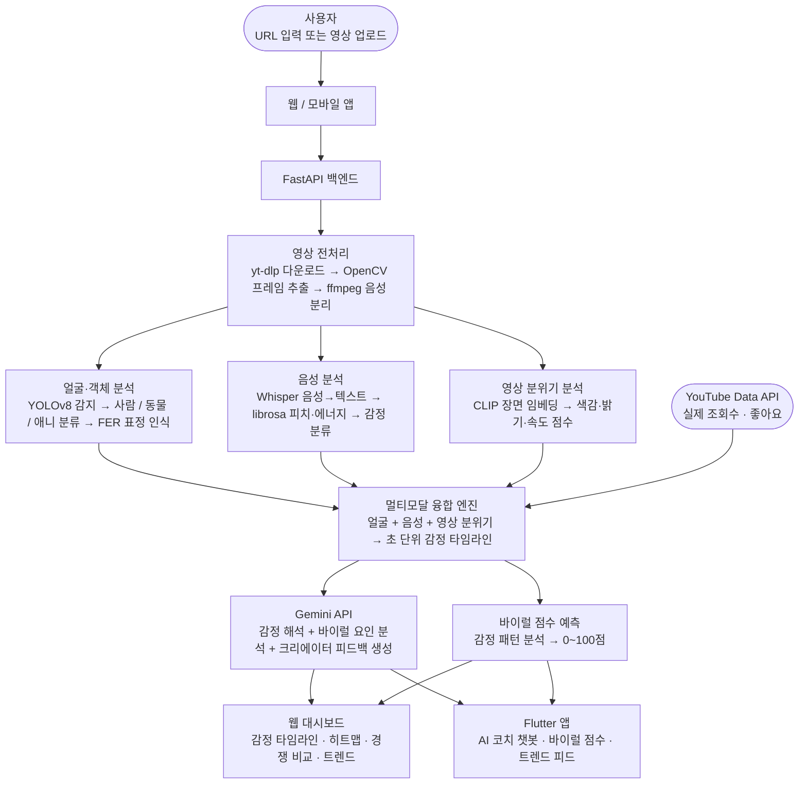
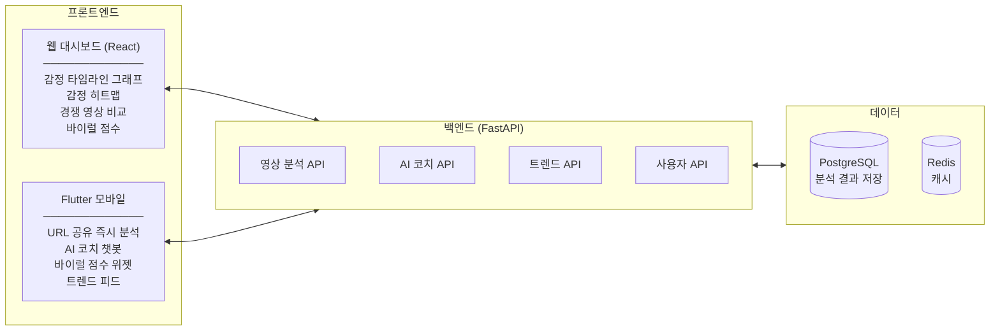
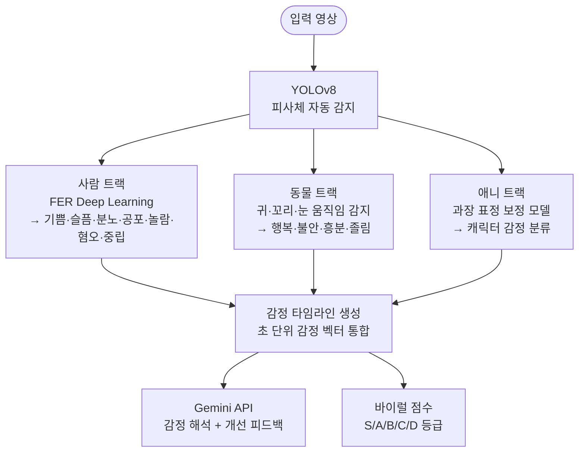
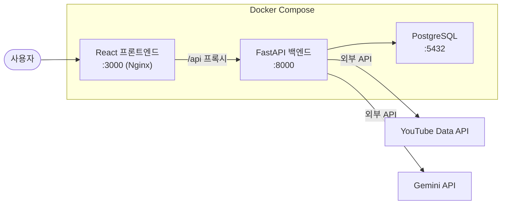
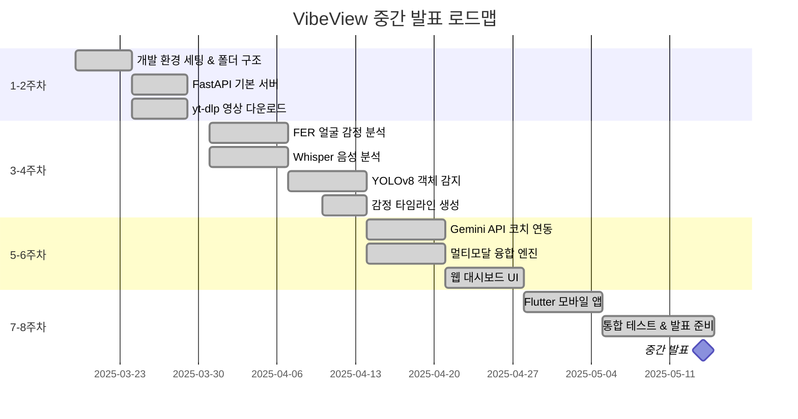
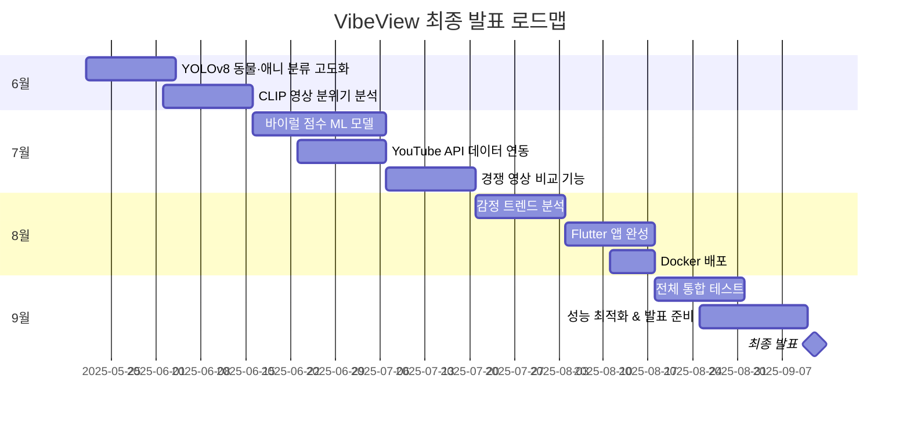

# VibeView

> **영상 감정 AI 분석 플랫폼**
> "감정이 조회수를 만든다" — YouTube Shorts·애니메이션 영상 속 감정 신호를 분석해 바이럴 요소를 찾아내는 멀티모달 AI 플랫폼

---

## 목차

1. [프로젝트 개요](#프로젝트-개요)
2. [핵심 기능](#핵심-기능)
3. [시스템 아키텍처](#시스템-아키텍처)
4. [기술 스택](#기술-스택)
5. [폴더 구조](#폴더-구조)
6. [설치 및 실행](#설치-및-실행)
7. [Docker 배포](#docker-배포)
8. [API 명세](#api-명세)
9. [개발 로드맵](#개발-로드맵)

---

## 프로젝트 개요

| 항목 | 내용 |
|------|------|
| **프로젝트명** | VibeView |
| **슬로건** | 감정이 조회수를 만든다 |
| **분석 대상** | YouTube Shorts 등 짧은 영상, 애니메이션 영상 |
| **분석 요소** | 얼굴 표정 / 목소리 감정 / 영상 전체 분위기 |
| **결과물** | 웹 대시보드 + Flutter 모바일 앱 |

### 기획 의도

YouTube Shorts 같은 숏폼 플랫폼에서 조회수를 결정하는 핵심 요소는 **감정적 반응**입니다.
기존 분석 도구는 조회수·좋아요 같은 결과 데이터만 제공하며, "왜 이 영상이 바이럴됐는가"에 대한 답을 주지 않습니다.

VibeView는 얼굴 표정, 목소리 톤, 영상 분위기를 AI로 실시간 분석하고 이를 실제 조회수 데이터와 연결해 **바이럴의 원인**을 찾아냅니다.

---

## 핵심 기능

### 1. 멀티모달 감정 분석
- 얼굴 표정 분석 (FER — Deep Learning 기반 7가지 감정 분류)
- 목소리 감정 분석 (Whisper STT + librosa 피치·에너지)
- 영상 전체 분위기 분석 (CLIP 모델)
- 사람·동물(개, 고양이)·애니 캐릭터 자동 분류 (YOLOv8)
- 초 단위 감정 타임라인 생성

### 2. AI 크리에이터 코치 (Gemini API)
- 분석 결과를 기반으로 구체적 개선 피드백 생성
- 예: "3~7초 구간 강아지 눈 맞춤 장면이 핵심입니다. 썸네일로 활용하세요"
- 채팅 인터페이스로 자유 질문 가능

### 3. 바이럴 점수 예측
- 감정 패턴 기반 0~100점 예측 (S/A/B/C/D 등급)
- 얼굴·음성·영상 분위기 종합 분석

### 4. 경쟁 영상 비교 분석
- 내 영상 vs 조회수 100만+ 영상 감정 패턴 비교
- 초반 3초, 중반, 후반부 감정 강도 차이 시각화

### 5. 실시간 감정 트렌드
- 최근 바이럴 영상 감정 패턴 분석
- "지금 유행하는 감정 흐름" 트렌드 제공

### 6. 동물·애니 특화 분석
- YOLOv8으로 피사체 자동 감지
- 동물: 귀, 꼬리, 눈 움직임 기반 감정 분류
- 애니: 캐릭터 표정 특화 모델 적용

---

## 시스템 아키텍처

### 전체 데이터 흐름



---

### 플랫폼 구성



---

### AI 분석 파이프라인



---

### 배포 구성 (Docker)



---

## 기술 스택

| 분류 | 기술 | 용도 |
|------|------|------|
| **모바일** | Flutter (Dart) | iOS / Android 크로스플랫폼 |
| **웹 프론트엔드** | React + Recharts | 대시보드 시각화 |
| **백엔드** | Python, FastAPI | REST API 서버 |
| **얼굴 분석** | FER (Deep Learning) | 7가지 감정 분류 |
| **객체 감지** | YOLOv8 | 사람·동물·애니 분류 |
| **음성 분석** | OpenAI Whisper + librosa | STT + 피치·에너지 감정 |
| **영상 분위기** | CLIP (OpenAI) | 장면 임베딩 분석 |
| **AI 코치** | Google Gemini API (gemini-2.5-flash) | 감정 해석 + 피드백 생성 |
| **영상 처리** | OpenCV + ffmpeg + yt-dlp | 프레임 추출 + 음성 분리 |
| **데이터** | YouTube Data API v3 | 조회수·좋아요 연동 |
| **DB** | PostgreSQL + Redis | 결과 저장 + 캐싱 |
| **배포** | Docker Compose | 컨테이너 배포 |

---

## 폴더 구조

```
vibeview/
├── mobile/                        # Flutter 모바일 앱
│   ├── lib/
│   │   └── main.dart              # 앱 전체 (화면 + 서비스 통합)
│   └── pubspec.yaml
│
├── web/                           # React 웹 대시보드
│   ├── src/
│   │   └── App.js                 # 대시보드 전체 (감정 타임라인, 코치 채팅)
│   └── package.json
│
├── server/                        # FastAPI 백엔드
│   ├── main.py                    # 앱 진입점, CORS 설정
│   ├── routers/
│   │   ├── analyze.py             # 영상 분석 엔드포인트
│   │   ├── coach.py               # AI 코치 엔드포인트
│   │   ├── trend.py               # 트렌드 엔드포인트
│   │   └── user.py                # 사용자 엔드포인트
│   ├── services/
│   │   ├── video_processor.py     # yt-dlp + OpenCV + ffmpeg
│   │   ├── face_analyzer.py       # FER + Gemini Vision
│   │   ├── audio_analyzer.py      # Whisper + librosa
│   │   ├── scene_analyzer.py      # CLIP 영상 분위기
│   │   ├── animal_analyzer.py     # YOLOv8 동물 분석
│   │   ├── fusion_engine.py       # 멀티모달 융합
│   │   ├── viral_predictor.py     # 바이럴 점수 예측
│   │   ├── gemini_coach.py        # Gemini API 코치
│   │   └── youtube_service.py     # YouTube Data API 연동
│   ├── cookies.txt.example        # yt-dlp 쿠키 파일 예시 (실제 파일은 gitignore)
│   ├── env.example                # 환경변수 예시
│   ├── Dockerfile
│   ├── auto_collect.py            # 바이럴 영상 자동 수집 스크립트
│   └── requirements.txt
│
├── web/
│   ├── Dockerfile
│   └── nginx.conf
│
├── docker-compose.yml
├── env.example                    # 루트 환경변수 예시
└── README.md
```

---

## 설치 및 실행

### 요구 사항

| 항목 | 버전 |
|------|------|
| Python | 3.11 이상 |
| Flutter | 3.x 이상 |
| Node.js | 18 이상 |
| Docker | 최신 버전 |
| ffmpeg | 최신 버전 |

### 환경 변수 설정

루트의 `env.example`을 복사해 `.env`로 저장하고 실제 값을 입력합니다.

```bash
cp env.example .env
cp server/env.example server/.env
```

```env
DB_PASSWORD=your_db_password
GEMINI_API_KEY=your_gemini_api_key
GOOGLE_API_KEY=your_google_api_key
YOUTUBE_API_KEY=your_youtube_data_api_key
```

### 백엔드 로컬 실행

```bash
cd server
pip install -r requirements.txt
uvicorn main:app --reload --port 8000
```

### 웹 프론트엔드 로컬 실행

```bash
cd web
npm install
npm start
```

### Flutter 모바일 실행

```bash
cd mobile
flutter pub get
flutter run -d chrome        # 웹 테스트
flutter run                  # 연결된 기기
```

---

## Docker 배포

```bash
# .env 파일 설정 후
docker compose up --build -d

# 서비스 확인
docker compose ps
```

| 서비스 | 주소 |
|--------|------|
| 웹 대시보드 | http://localhost:3000 |
| 백엔드 API | http://localhost:8000 |
| API 문서 | http://localhost:8000/docs |

> yt-dlp 쿠키가 필요한 경우 `server/cookies.txt.example`을 참고해 `server/cookies.txt`를 생성하세요.

---

## API 명세

### 영상 분석

```
POST /api/analyze
Body: { "url": "https://youtube.com/shorts/..." }
Response: {
  "video_id": "...",
  "duration": 30,
  "timeline": [...],        // 초 단위 감정 데이터
  "viral_score": 78,
  "viral_grade": "A",
  "dominant_emotion": "happy",
  "subjects": ["person", "dog"],
  "face_summary": { ... },
  "audio_summary": { ... }
}
```

### AI 코치

```
POST /api/coach
Body: { "video_id": "...", "question": "어떻게 개선할까요?" }
Response: { "feedback": "..." }
```

### 트렌드

```
GET /api/trend
Response: { "trends": [...] }  // 최근 감정 트렌드
```

---

## 개발 로드맵

### 중간 발표 목표



### 최종 발표 목표



---

## 핵심 차별점

- **멀티모달 AI**: 얼굴 + 음성 + 영상 분위기를 동시에 분석 (단일 모달 대비 정확도 향상)
- **실제 데이터 연동**: YouTube Data API로 실제 조회수와 감정 패턴을 연결
- **사람·동물·애니 지원**: YOLOv8 기반 피사체 자동 분류 및 특화 모델 적용
- **크로스플랫폼**: 웹 대시보드 + Flutter 모바일 앱 동시 지원
- **AI 코치**: 단순 분석을 넘어 Gemini API 기반 실용적 개선 제안 제공

---

*VibeView — 감정이 조회수를 만든다*
